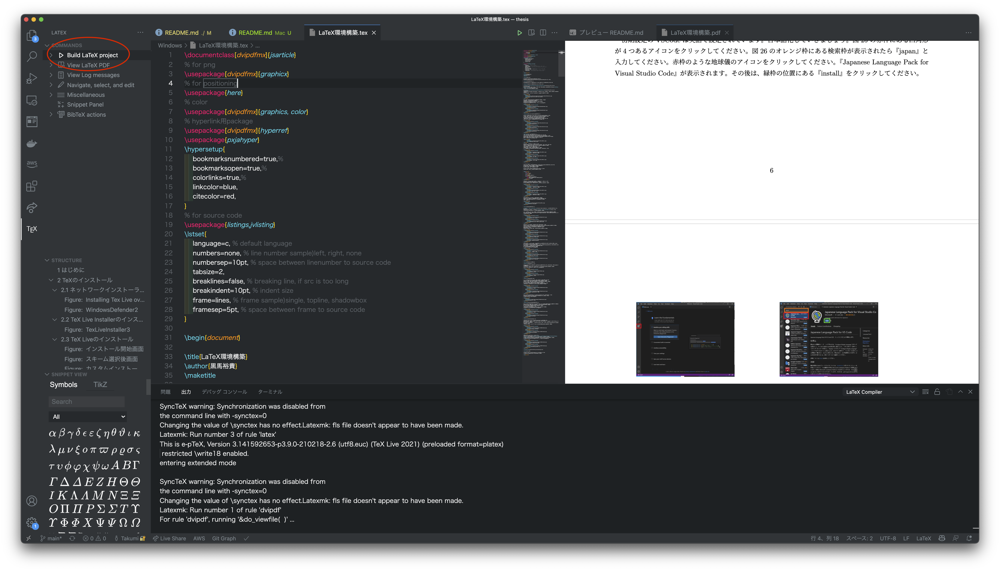
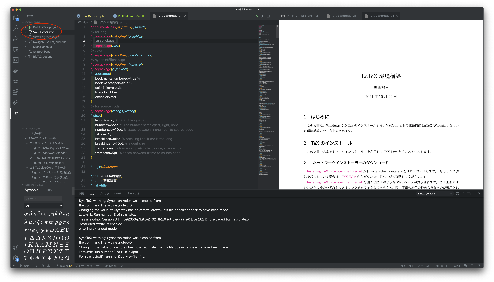

# Mac用の環境構築

MacでのLaTexの環境構築をまとめました。  
不明点があれば、

https://github.com/CIT-NakamuraLab/thesis/issues

issueにすると誰かが解決するかもしれません。

## LaTexインストール

かなり重い

```
brew install mactex-no-gui --cask
```

## LaTeX Workshopインストール

VScodeにLaTeX Workshopをインストールします。  
他のエディタを使っている人は知らん。

https://marketplace.visualstudio.com/items?itemName=James-Yu.latex-workshop

## setting.jsonに追加

VScodeのsetting.josnに以下を追加します。
jsonのシンタックスに気をつけてください。

https://github.com/CIT-NakamuraLab/thesis/blob/main/Mac/setting.json

## 使い方

### PDFを作成する

`*.tex`ファイルを開いて、VScodeの左側のタブで`Build LaTex project`を押すとPDFが作成されます。



### プレビューしながら作業する

`*.tex`ファイルは人間には読みづらいですよね。  
VScodeの右側でプレビューできます。
`*.tex`ファイルを開いて、VScodeの左側のタブで`View LaTex PDF`を押すとPDFが作成されます。

