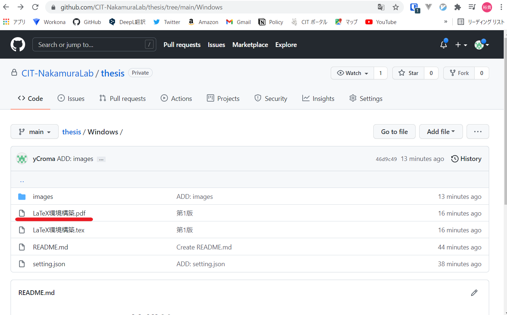
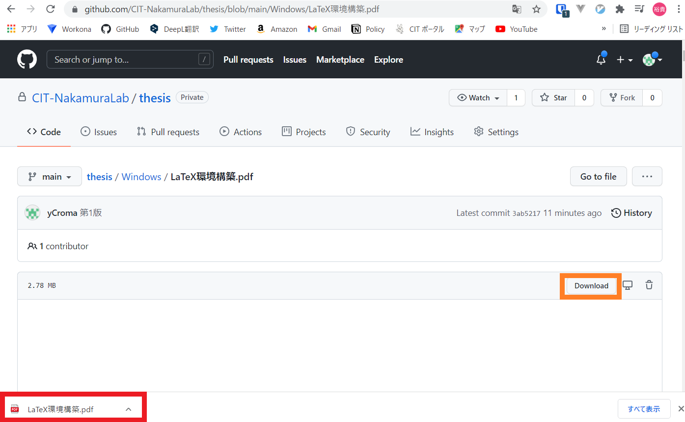

# Windows用の環境構築

このディレクトリにWindowsでの環境構築方法をまとめます。  
不明点があれば、

https://github.com/CIT-NakamuraLab/thesis/issues

issueにすると誰かが解決するかもしれません。

## pdfの利用方法

pdfにはリンクが埋め込まれています。githubのWebサイト上では、pdfのリンクが効かないため、1度ダウンロードしてもらう必要があります。  
1枚目の画像の赤線の部分にあるpdfへのリンクをクリックしてください。  
もしくは、https://github.com/CIT-NakamuraLab/thesis/blob/main/Windows/LaTeX%E7%92%B0%E5%A2%83%E6%A7%8B%E7%AF%89.pdf をクリックしてもらえれば2枚目の画像の画面に飛びます。  
2枚目の画像の画面になったら、オレンジ枠の『Download』をクリックしてください。成功すると下の赤枠のようにpdfがダウンロードされると思うので、クリックしていただけると、リンクが効いたPDFが表示されます。

#### 画像1

#### 画像2

